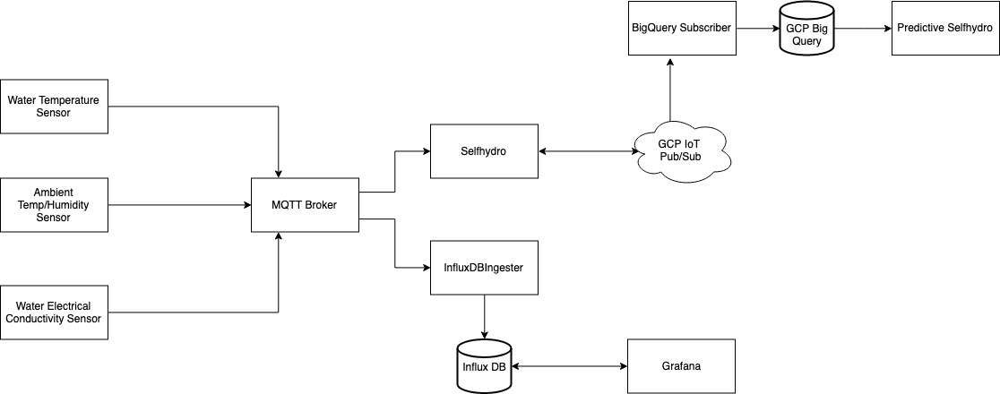

# SelfHydro - Automated Hydroponics

[](https://goreportcard.com/report/github.com/selfhydro/selfhydro)

This is an automated hydroponic system, focusing on getting the current state of the system.

The system currently consists of the following:
- Lights on a timed cycle
- Air pump cycle
- Water level of the tank
- Temperature, Humidity, Electrical Conductivity sensors

## Overview of system architecture



## Sensors
- Water temperature sensor is a DS18B20 sensor.
- Ambient temperature sensor is a MCP9808 sensor, communicating using I2C.
- Water level sensor is Ultrasonic HC-SR04 sensor.

The system is designed to work on the Raspberry Pi 3.

### MQTT Comms to GCP
Every 3 hours the system will send a json message with the telemetry to google cloud IoT core.

To add the config file for communication with GCP, run the following step:
1. Create a file config/googleCloudIoTConfig.json
2. Insert the following json:
```
{
  "location": "<location>",
  "projectID": "<projectID>",
  "registryID": "<registryID>",
  "deviceID": "<deviceID>"
}
```

### Installing Selfhydro up as a service

1. ``cp selfhydro.service /etc/systemd/system/selfhydro.service``
2. ``sudo systemctl enable selfhydro.service``

### Wifi-Connect
For first time setup of device, wifi connect is used to setup the wifi network.

Install using:
```
bash <(curl -L https://github.com/resin-io/resin-wifi-connect/raw/master/scripts/raspbian-install.sh)
```

### Setting up RaspberryPi for the first time

- Enable 1-wire:
   + `sudo nano /boot/config.txt`
   + `sudo reboot`
   + `sudo modprobe w1-gpio`
   + `sudo modprobe w1-therm`

### Mosquite MQTT Broker
```docker run -it -p 1883:1883 -p 9001:9001 --restart always -d eclipse-mosquitto```

### Roadmap:
- Config file for pins being used on Raspberry Pi
- Refactor all sensors into sensor directory
- Setup CICD pipeline
